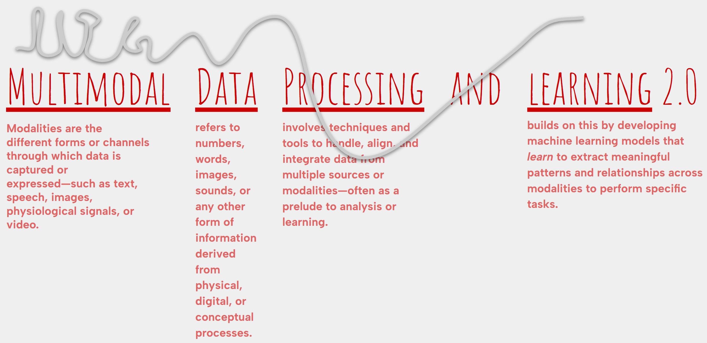

<!--  -->

## Pre-requisites
- Curiosity about signals and data
- Interested to build applications with that curiosity
- Familiarity with ML, DL, Signals and Systems, and Python Programming

## Logistics

**Core Course**: For Third Year B.Tech in Data Science and AI students

**Class Room**: 5205, Core-5

**Timings**: 4:00 pm, Tue || 3:00 pm, Wed || 2:00 pm, Thu

Please visit this page regularly for updated information on the course. 
